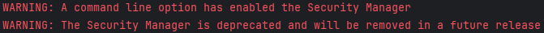

# Diobfuscator
A deobfuscator for java

> [!IMPORTANT]
> **This is dev(v2) version of diobfuscator version and it's not completed yet, if you are willing to help there is a list of things that needs to be completed. The old diobfuscator was moved to [v1 branch](https://github.com/narumii/Deobfuscator/tree/v1).** 
> 
> - Porting old transformers to new code base
> - Testing InstructionMatcher
> - Implementing/Improving transformers
> - Writing tests
> - Feedback on how the new api presents itself (mainly InstructionMatcher)
>    
> 
> 1. *You can also provide samples of obfuscation to help with development of the transformers.*
> 2. **No... there is no gui planned**
> 3. _Also from now on Diobfuscator uses [Java Google Codestyle](https://github.com/google/styleguide/blob/gh-pages/intellij-java-google-style.xml)_
>    - `mvn fmt:format`
>    - `mvn fmt:check`

> Built on: [Java 17 (Temurin)](https://adoptium.net/temurin/releases/?version=17)

## ✅ How to run deobfuscator
If you want to use this deobfuscator, you need to start it from your IDE manually.

1. Place your obfuscated jar inside the root project directory. For example in `work/obf-test.jar`
2. Navigate to class [`Bootstrap.java`](./deobfuscator-impl/src/test/java/Bootstrap.java)
3. In this class edit the deobfuscator configuration
    - `inputJar` - Your obfuscated jar file that you placed in step 1
    - `transformers` - Pick transformers that you want to run. You can find them in [`deobfuscator-transformers`](./deobfuscator-transformers) module.
4. Run this class manually from your IDE. You MUST use our pre-configured IntelliJ task named `Bootstrap` OR append `-Djava.security.manager -Djava.security.policy=./security-policy.txt` to the java command's VM options.

> [!NOTE]
> As you probably saw, java tells us that we are using `SecurityManager` which is deprecated and marked for removal.
> 
> 
> 
> The deobfuscator uses the class `SandboxClassLoader` that can safely load classes from untrusted places. The main feature of this classloader is that it prevents dangerous calls like `System.exit`, file operations or command execution. As you can see in [JEP 411](https://openjdk.org/jeps/411) there isn't currently any alternative, but they want to add different API before `SecurityManager` removal. So for now this is okay to use `SecurityManager` as this is the only option.

## 🔧 Contributing
Contributions are welcome! See [CONTRIBUTING.md](./CONTRIBUTING.md) for more information.

---

     

---

