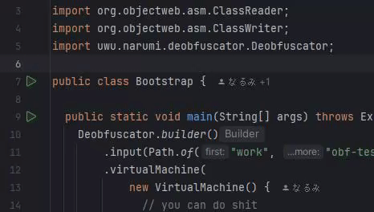

# Diobfuscator
A deobfuscator for java

> If you are looking for v1 version of Diobfuscator, you can find it [here](https://github.com/narumii/Deobfuscator/tree/v1)

## ✅ How to run deobfuscator
If you want to use this deobfuscator, you need to start it from your IDE manually.

### Prerequisites
**Important:** You need TWO different Java installations:
- **[Java 17](https://adoptium.net/temurin/releases/?version=17)** - Required for the project to compile and run
- **[Java 8](https://adoptium.net/temurin/releases/?version=8)** - Required for the sandbox (SSVM) to work properly

### Instructions
1. Clone this repository and open it in IntelliJ
2. Make sure that you have selected [Java 17](https://adoptium.net/temurin/releases/?version=17) in `Project Structure` -> `SDK`
3. Install [Java 8](https://adoptium.net/temurin/releases/?version=8) if you don't have it already
4. Place your obfuscated jar inside the root project directory. For example in `work/obf-test.jar`
5. Navigate to class [`Bootstrap.java`](./deobfuscator-impl/src/test/java/Bootstrap.java)
6. In this class edit the deobfuscator configuration
    - `inputJar` - Your obfuscated jar file that you placed in step 4
    - `transformers` - Pick transformers that you want to run. You can find them in [`deobfuscator-transformers`](./deobfuscator-transformers/src/main/java/uwu/narumi/deobfuscator/core/other) module.
7. Run this class manually from your IDE. You can use our pre-configured IntelliJ task named `Bootstrap`.

## 🔧 Contributing
Contributions are welcome! See [CONTRIBUTING.md](./CONTRIBUTING.md) for a project introduction and some basics about java bytecode.

## ❓ FAQ

**Q: Sandbox doesn't work / "rt.jar is required for sandbox to run" error**

A: The sandbox requires rt.jar from **[Java 8](https://adoptium.net/temurin/releases/?version=8)** installation. The deobfuscator will try to auto-detect it, but if it fails:
- Make sure you have [Java 8](https://adoptium.net/temurin/releases/?version=8) installed
- You can manually set it via system property: `-DrtJarPath="path/to/rt.jar"`
- Or specify it in your Bootstrap configuration: `.rtJarPath(Path.of("path/to/rt.jar"))`
- Common rt.jar locations (may vary based on installation):
  - Oracle JDK 8: `C:/Program Files/Java/jdk1.8.0_202/jre/lib/rt.jar`
  - Eclipse Adoptium JDK 8: `C:/Program Files/Eclipse Adoptium/jdk-8.0.462.8-hotspot/jre/lib/rt.jar`

## Links

